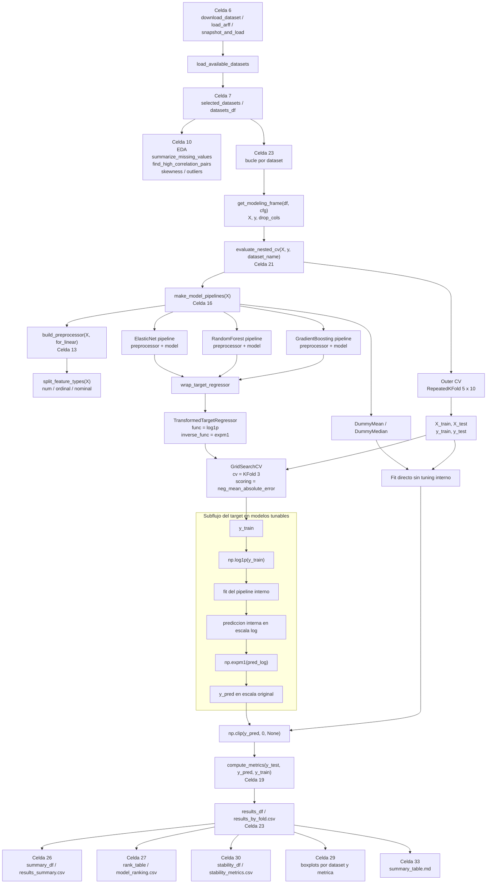

# Explicacion detallada de `log1p` / `expm1`, EDA y Nested Repeated Cross-Validation

Este documento explica, con referencia directa a las celdas y funciones reales de `effort_estimation.ipynb`, cuatro partes clave del notebook:

- como se usan `np.log1p` y `np.expm1`
- como funciona la **celda 10: Exploratory Data Audit**
- como funciona la **celda 21: Nested Repeated Cross-Validation Evaluation**
- como encaja todo dentro del flujo completo del notebook

La idea no es solo describir el objetivo general, sino recorrer el codigo real paso a paso: que entra, que sale, por que se calcula cada variable y como se conectan las piezas metodologicas.

## 1. Intuicion matematica de `log1p` y `expm1`

Las dos funciones clave son:

- `log1p(y) = log(1 + y)`
- `expm1(z) = exp(z) - 1`

Se usan juntas porque son funciones inversas:

- si transformas el target con `log1p`
- luego puedes volver a la escala original con `expm1`

En estimacion de esfuerzo esto es util porque el target suele tener cola derecha:

- muchos proyectos pequenos o medianos
- pocos proyectos muy grandes
- esos proyectos grandes pueden dominar el ajuste

Al aplicar `log1p(y)`:

- los valores grandes se comprimen
- la distribucion del target suele quedar menos sesgada
- el entrenamiento puede ser mas estable
- el modelo deja de estar tan dominado por unos pocos casos extremos

`log1p` es preferible a `log(y)` cuando puede haber valores pequenos o cero:

- `log(0)` no existe
- `log1p(0) = log(1) = 0`

Despues, para recuperar la escala original de esfuerzo, se usa `expm1`.

## 2. Donde aparece exactamente en el codigo

El punto exacto donde se define la transformacion del target esta en la **celda 16**, en la funcion `wrap_target_regressor()`:

```python
def wrap_target_regressor(regressor) -> TransformedTargetRegressor:
    return TransformedTargetRegressor(
        regressor=regressor,
        func=np.log1p,
        inverse_func=np.expm1,
        check_inverse=False,
    )
```

Esta funcion crea un `TransformedTargetRegressor`. Ese wrapper hace dos cosas automaticamente:

- durante `fit`, transforma internamente `y` con `np.log1p`
- durante `predict`, invierte esa transformacion con `np.expm1`

En la misma **celda 16**, dentro de `make_model_pipelines()`, este wrapper se aplica a:

- `ElasticNet`
- `RandomForestRegressor`
- `GradientBoostingRegressor`

En cambio, los baselines:

- `DummyRegressor(strategy="mean")`
- `DummyRegressor(strategy="median")`

no pasan por `wrap_target_regressor()`. Por tanto:

- no usan `log1p`
- no usan `expm1`
- se entrenan y predicen directamente en escala original

## 3. Que transforma `X` y que transforma `y`

En el notebook hay dos familias de transformaciones distintas, y es importante no mezclarlas.

### Transformaciones sobre `X`

Las transformaciones de las variables predictoras viven en la **celda 13**, con:

- `split_feature_types(X)`
- `build_preprocessor(X, for_linear)`

Aqui ocurre:

- numericas: imputacion por mediana
- ordinales: imputacion por moda + `OrdinalEncoder`
- nominales: imputacion por moda + `OneHotEncoder`
- para modelos lineales: escalado con `StandardScaler`

Todo esto actua sobre `X`.

### Transformacion sobre `y`

La transformacion del target vive en la **celda 16**, con `wrap_target_regressor()`.

Aqui ocurre:

- en entrenamiento: `y_train -> log1p(y_train)`
- en prediccion: `pred_log -> expm1(pred_log)`

Todo esto actua sobre `y`.

En resumen:

- `X` se transforma en la celda 13
- `y` se transforma en la celda 16

## 4. Exploratory Data Audit, explicado de forma exhaustiva

La **celda 10** no entrena modelos. Su funcion es auditar la calidad y la estructura de los datos antes del modelado. Esta parte del notebook sirve para responder preguntas como:

- cuantos valores perdidos hay
- si hay predictores numericos muy correlacionados
- si el target esta sesgado
- si el target presenta outliers segun IQR
- cuantas variables numericas y categoricas quedan despues de eliminar leakage

La celda 10 tiene dos funciones auxiliares y luego un bucle principal por dataset.

### 4.1 `summarize_missing_values(df)`

Codigo base:

```python
def summarize_missing_values(df: pd.DataFrame) -> pd.DataFrame:
    missing_df = (
        df.isna()
        .sum()
        .rename("missing_count")
        .reset_index()
        .rename(columns={"index": "column"})
    )
    missing_df["missing_pct"] = missing_df["missing_count"] / len(df)
    missing_df = missing_df[missing_df["missing_count"] > 0].sort_values(
        ["missing_count", "column"], ascending=[False, True]
    )
    return missing_df.reset_index(drop=True)
```

Que hace paso a paso:

1. `df.isna()` crea una matriz booleana del mismo tamano que el dataset.
   Cada celda vale `True` si falta el dato y `False` si no falta.

2. `.sum()` suma por columna esos booleanos.
   En pandas, `True` cuenta como `1` y `False` como `0`, asi que el resultado es el numero de valores perdidos por columna.

3. `.rename("missing_count")` da nombre a esa serie.

4. `.reset_index()` convierte la serie en `DataFrame`.

5. `.rename(columns={"index": "column"})` deja dos columnas claras:
   - `column`
   - `missing_count`

6. `missing_df["missing_pct"] = missing_df["missing_count"] / len(df)` calcula el porcentaje de missing respecto al numero total de filas.

7. `missing_df[missing_df["missing_count"] > 0]` elimina columnas sin missing.
   Esto hace la salida mas compacta y mas util para auditar.

8. `.sort_values(["missing_count", "column"], ascending=[False, True])` ordena:
   - primero por mas missing
   - y en empate, alfabeticamente por nombre de columna

9. `.reset_index(drop=True)` deja el indice limpio.

Por que esta funcion usa `df` completo y no `X`:

- porque aqui se quiere auditar el snapshot real del dataset cargado
- eso incluye tambien la columna target y cualquier columna que luego se excluya
- como ejercicio de calidad de datos, interesa ver el estado del dataset completo antes de entrar en el pipeline

### 4.2 `find_high_correlation_pairs(X, threshold=EDA_CORR_THRESHOLD)`

Codigo base:

```python
def find_high_correlation_pairs(X: pd.DataFrame, threshold: float = EDA_CORR_THRESHOLD) -> pd.DataFrame:
    numeric_cols = X.select_dtypes(include=[np.number]).columns.tolist()
    if len(numeric_cols) < 2:
        return pd.DataFrame(columns=["feature_a", "feature_b", "abs_corr"])

    corr = X[numeric_cols].corr().abs()
    upper = corr.where(np.triu(np.ones(corr.shape), k=1).astype(bool))

    pairs = []
    for col in upper.columns:
        strong_pairs = upper.index[upper[col] >= threshold].tolist()
        for row_name in strong_pairs:
            pairs.append(
                {
                    "feature_a": row_name,
                    "feature_b": col,
                    "abs_corr": float(upper.loc[row_name, col]),
                }
            )

    if not pairs:
        return pd.DataFrame(columns=["feature_a", "feature_b", "abs_corr"])

    return pd.DataFrame(pairs).sort_values("abs_corr", ascending=False).reset_index(drop=True)
```

Que hace paso a paso:

1. `X.select_dtypes(include=[np.number])` se queda solo con predictores numericos.
   La correlacion de Pearson solo tiene sentido directo en columnas numericas.

2. Si hay menos de dos columnas numericas, la funcion devuelve un `DataFrame` vacio con estructura fija.
   Esto evita errores y mantiene consistente la salida.

3. `X[numeric_cols].corr()` calcula la matriz de correlacion entre todas las variables numericas.

4. `.abs()` toma valor absoluto.
   Esto significa que el notebook trata igual:
   - una correlacion `0.90`
   - una correlacion `-0.90`

   Ambas indican relacion lineal fuerte, aunque cambie el signo.

5. `np.triu(np.ones(corr.shape), k=1)` crea una mascara triangular superior, excluyendo la diagonal principal.

6. `corr.where(...)` deja solo la mitad superior de la matriz.
   Esto evita duplicados:
   - si ya has visto `AFP` con `Input`
   - no necesitas volver a listar `Input` con `AFP`

7. Se recorre cada columna de `upper.columns`.

8. `upper.index[upper[col] >= threshold].tolist()` localiza las filas cuya correlacion absoluta con esa columna supera el umbral.

9. Para cada par fuerte se guarda un diccionario con:
   - `feature_a`
   - `feature_b`
   - `abs_corr`

10. Si no se encontro ningun par fuerte, se devuelve un `DataFrame` vacio con columnas fijas.

11. Si si se encontraron pares, se convierten en `DataFrame`, se ordenan por `abs_corr` descendente y se limpia el indice.

Por que esta funcion usa `X` y no `df`:

- porque quiere estudiar solo predictores candidatos al modelo
- no interesa mezclar aqui la columna target
- tampoco interesa incluir columnas ya excluidas por leakage o por irrelevancia

En otras palabras:

- missing values: estado general del dataset cargado
- correlaciones: estructura interna de los predictores que realmente van a modelarse

### 4.3 El bucle principal por dataset

Despues de definir las funciones auxiliares, la celda crea:

```python
eda_rows = []
```

Esta lista va a almacenar un resumen agregado por dataset.

Luego empieza:

```python
for dataset_name, cfg in selected_dataset_configs.items():
```

Esto significa que el EDA se ejecuta una vez por dataset seleccionado.

#### 4.3.1 Copia del dataset y separacion de `X` e `y`

Dentro del bucle:

```python
df = datasets_df[dataset_name].copy()
X, y, drop_cols = get_modeling_frame(df, cfg)
```

Aqui ocurre:

- `df` es una copia del dataset cargado
- `get_modeling_frame()` separa predictores y target
- `drop_cols` registra columnas excluidas antes del modelado

Por que esto es importante:

- `df` representa el dataset tal como se cargo
- `X` representa solo los predictores validos para el modelo
- `y` representa solo el objetivo

Esta separacion es la base para que cada analisis use la vista correcta:

- missing values: `df`
- correlaciones entre predictores: `X`
- outliers del objetivo: `y`

#### 4.3.2 Conteo de variables numericas y categoricas

Luego el codigo hace:

```python
predictor_numeric_cols = X.select_dtypes(include=[np.number]).columns.tolist()
predictor_categorical_cols = X.select_dtypes(exclude=[np.number]).columns.tolist()
```

Esto cuantifica cuantas variables predictoras de cada tipo quedan tras las exclusiones.

Interpretacion:

- si hay muchas numericas, el pipeline tendra mas peso de imputacion y correlacion lineal
- si hay muchas categoricas, el pipeline necesitara mas encoding
- esto ayuda a justificar luego la celda 13, donde el preprocesado se adapta al tipo de variable

#### 4.3.3 Missing values y correlaciones

Despues:

```python
missing_df = summarize_missing_values(df)
corr_pairs_df = find_high_correlation_pairs(X)
```

Aqui se ve de forma muy clara la separacion metodologica:

- `missing_df` usa `df`, porque audita calidad de datos del snapshot completo
- `corr_pairs_df` usa `X`, porque las correlaciones solo interesan entre predictores realmente usados

#### 4.3.4 Calculo de IQR y outliers del target

El siguiente bloque es:

```python
q1 = y.quantile(0.25)
q3 = y.quantile(0.75)
iqr_value = q3 - q1
lower_bound = q1 - 1.5 * iqr_value
upper_bound = q3 + 1.5 * iqr_value
outlier_count = int(((y < lower_bound) | (y > upper_bound)).sum())
```

Paso a paso:

1. `q1` es el percentil 25 del target.

2. `q3` es el percentil 75 del target.

3. `iqr_value = q3 - q1` es el rango intercuartil.
   Mide la dispersion central del target.

4. `lower_bound` y `upper_bound` aplican la regla clasica de boxplot:
   - limite inferior = `Q1 - 1.5 * IQR`
   - limite superior = `Q3 + 1.5 * IQR`

5. `((y < lower_bound) | (y > upper_bound))` construye una mascara booleana para casos fuera de esos limites.

6. `.sum()` cuenta cuantos hay.

7. `int(...)` lo deja como entero normal para guardarlo y mostrarlo.

Por que se calcula sobre `y`:

- porque aqui se estan auditando outliers del objetivo, no de los predictores
- esto es relevante para la interpretacion del problema de estimacion
- un target con cola larga y muchos outliers es una motivacion directa para usar `log1p`

#### 4.3.5 Construccion de `eda_rows`

Despues el notebook guarda un resumen por dataset:

```python
eda_rows.append(
    {
        "dataset": dataset_name,
        "rows": int(len(df)),
        "columns": int(df.shape[1]),
        "predictors_after_drop": int(X.shape[1]),
        "numeric_predictors": int(len(predictor_numeric_cols)),
        "categorical_predictors": int(len(predictor_categorical_cols)),
        "missing_cells": int(df.isna().sum().sum()),
        "target_mean": float(y.mean()),
        "target_median": float(y.median()),
        "target_skew": float(y.skew()),
        "target_iqr": float(iqr_value),
        "iqr_outliers": outlier_count,
    }
)
```

Cada campo resume una propiedad distinta:

- `rows`: numero de proyectos
- `columns`: numero total de columnas en el dataset original cargado
- `predictors_after_drop`: numero de predictores realmente disponibles tras quitar target y columnas excluidas
- `numeric_predictors`: cuantas variables numericas quedan
- `categorical_predictors`: cuantas categoricas quedan
- `missing_cells`: total de celdas perdidas en el dataset cargado
- `target_mean` y `target_median`: resumen central del esfuerzo
- `target_skew`: asimetria del target
- `target_iqr`: dispersion robusta central
- `iqr_outliers`: numero de outliers del target segun la regla IQR

Esto no reemplaza los detalles por columna, pero crea un resumen compacto muy util para comparar datasets.

#### 4.3.6 Impresion de texto e interpretacion inmediata

Luego el notebook imprime:

```python
print(f"=== {dataset_name} audit ===")
print(f"Rows={len(df)}, columns={df.shape[1]}, predictors after exclusions={X.shape[1]}")
print(f"Numeric predictors={len(predictor_numeric_cols)}, categorical predictors={len(predictor_categorical_cols)}")
print(f"Target skewness={y.skew():.3f} | IQR outliers={outlier_count}")
```

Esto da una lectura rapida del dataset antes incluso de mirar tablas y figuras.

Que aporta cada linea:

- tamano total del dataset
- tamano real del espacio predictivo tras exclusiones
- mezcla de numericas y categoricas
- senal inmediata de asimetria y outliers del target

#### 4.3.7 Visualizacion de exclusiones por leakage o irrelevancia

Si `drop_cols` no esta vacio, el notebook construye:

```python
exclusion_df = pd.DataFrame(
    {
        "column": drop_cols,
        "reason": [cfg.get("drop_reasons", {}).get(col, "Excluded before modeling") for col in drop_cols],
    }
)
```

Y luego la muestra con `display(exclusion_df)`.

Esto es metodologicamente importante porque documenta por que ciertas variables no entran al modelo. En el notebook no se eliminan columnas sin explicar nada; se deja una justificacion explicita, por ejemplo:

- leakage derivado del esfuerzo
- identificadores sin valor predictivo
- outcomes post-hoc no disponibles al predecir

#### 4.3.8 Visualizacion de missing values

Luego:

```python
if missing_df.empty:
    print("Missing values: none detected in the current snapshot.")
else:
    print("Missing values by column:")
    display(missing_df)
```

Esto deja dos posibles escenarios:

- no hay missing y el dataset esta limpio en ese aspecto
- si los hay, se muestran exactamente por columna y con porcentaje

Conceptualmente esto ayuda a justificar por que luego el pipeline incluye imputadores.

#### 4.3.9 Visualizacion de correlaciones altas

Despues:

```python
if corr_pairs_df.empty:
    print(f"No numeric predictor pairs above |corr| >= {EDA_CORR_THRESHOLD:.2f} after exclusions.")
else:
    print(f"Top numeric predictor pairs above |corr| >= {EDA_CORR_THRESHOLD:.2f}:")
    display(corr_pairs_df.head(10))
```

Esto identifica redundancias o relaciones fuertes entre predictores numericos.

Interpretacion:

- si aparecen muchos pares muy correlacionados, puede haber informacion casi duplicada
- eso suele afectar mas a modelos lineales que a modelos basados en arboles
- por eso este analisis conecta bien con la comparacion posterior entre `ElasticNet` y ensembles

#### 4.3.10 Histograma y boxplot del target

Despues el notebook genera:

```python
fig, axes = plt.subplots(1, 2, figsize=(12, 4))
sns.histplot(y, kde=True, ax=axes[0])
axes[0].set_title(f"{dataset_name} target distribution")
axes[0].set_xlabel(cfg["target"])

sns.boxplot(x=y, ax=axes[1])
axes[1].set_title(f"{dataset_name} target boxplot")
axes[1].set_xlabel(cfg["target"])

plt.tight_layout()
plt.savefig(FIGURES_DIR / f"eda_target_{dataset_name.lower()}.png", dpi=150)
plt.show()
```

Que hace cada parte:

- `plt.subplots(1, 2, ...)` crea dos paneles lado a lado
- `histplot` muestra la distribucion del target
- `kde=True` superpone una curva suavizada
- `boxplot` muestra mediana, rango intercuartil y posibles outliers
- `tight_layout()` ajusta el espaciado
- `savefig(...)` guarda la figura en disco
- `show()` la renderiza en el notebook

Por que son utiles ambos graficos:

- el histograma muestra forma general, sesgo y posibles colas
- el boxplot resume de forma robusta el centro y la dispersion, y senala valores extremos

Ambos graficos son parte de la justificacion de por que puede interesar modelar con transformacion logaritmica del target.

#### 4.3.11 Tabla final `eda_summary_df`

Al final de la celda:

```python
eda_summary_df = pd.DataFrame(eda_rows).round(4)
print("Combined EDA summary:")
display(eda_summary_df)
```

Esto construye una tabla comparativa entre datasets.

Que aporta:

- deja en una sola vista las propiedades mas importantes de cada dataset
- facilita redactar el informe tecnico
- conecta EDA con decisiones metodologicas posteriores

### 4.4 Lectura conceptual del EDA

Si lees la celda 10 como bloque metodologico completo, esta respondiendo a estas preguntas:

1. Los datos tienen missing values y en que columnas.

2. Cuantas variables numericas y categoricas hay realmente despues de eliminar leakage.

3. El target esta sesgado.
   Si `target_mean` y `target_median` difieren bastante y `target_skew` es alto, eso refuerza la justificacion de `log1p`.

4. Hay pares de predictores muy correlacionados.
   Eso es relevante para la interpretacion de estabilidad y para comparar familias de modelos.

5. Hay outliers en el target segun IQR.
   Esto tambien apoya el uso de metricas robustas y transformacion del target.

En resumen, la celda 10 no es un adorno visual. Es la parte que justifica:

- el uso de imputacion
- el tratamiento separado de tipos de variables
- el interes de metricas robustas
- la motivacion para usar `log1p(y)` en los modelos tunables

## 5. Preprocesado y construccion de pipelines, en relacion con el EDA

Despues del EDA, la **celda 13** transforma `X` y la **celda 16** construye los pipelines.

La conexion logica es esta:

- el EDA detecta mezcla de variables numericas y categoricas
- `split_feature_types()` formaliza esa separacion
- `build_preprocessor()` aplica el tratamiento correcto a cada bloque
- `make_model_pipelines()` combina ese preprocesado con cada modelo
- `wrap_target_regressor()` anade la transformacion de `y`

Esto permite una separacion muy clara:

- EDA: entender el problema
- preprocessing: preparar `X`
- transformed target: preparar `y`
- nested CV: evaluar de forma rigurosa

## 6. Nested Repeated Cross-Validation Evaluation, explicado de forma exhaustiva

La **celda 21** implementa el corazon experimental del notebook. Esta celda no solo evalua modelos; organiza toda la metodologia de entrenamiento, tuning y estimacion final.

Codigo base:

```python
def evaluate_nested_cv(
    X: pd.DataFrame,
    y: pd.Series,
    dataset_name: str,
    random_state: int = 42,
) -> pd.DataFrame:
    model_specs = make_model_pipelines(X, random_state=random_state)

    outer_cv = RepeatedKFold(
        n_splits=OUTER_SPLITS,
        n_repeats=OUTER_REPEATS,
        random_state=random_state,
    )

    rows = []

    for fold_id, (train_idx, test_idx) in enumerate(outer_cv.split(X, y), start=1):
        X_train, X_test = X.iloc[train_idx], X.iloc[test_idx]
        y_train = y.iloc[train_idx].astype(float)
        y_test = y.iloc[test_idx].astype(float)

        inner_cv = KFold(n_splits=INNER_SPLITS, shuffle=True, random_state=random_state)

        for model_name, spec in model_specs.items():
            estimator = clone(spec["estimator"])
            param_grid = spec["param_grid"]

            if param_grid:
                gs = GridSearchCV(
                    estimator=estimator,
                    param_grid=param_grid,
                    cv=inner_cv,
                    scoring="neg_mean_absolute_error",
                    n_jobs=-1,
                    refit=True,
                )
                gs.fit(X_train, y_train)
                fitted_estimator = gs.best_estimator_
                best_params = gs.best_params_
            else:
                fitted_estimator = estimator.fit(X_train, y_train)
                best_params = {}

            y_pred = np.asarray(fitted_estimator.predict(X_test), dtype=float)
            y_pred = np.clip(y_pred, a_min=0, a_max=None)

            metrics = compute_metrics(y_test.to_numpy(), y_pred, y_train.to_numpy())

            row = {
                "dataset": dataset_name,
                "fold": fold_id,
                "model": model_name,
                "best_params": json.dumps(best_params),
            }
            row.update(metrics)
            rows.append(row)

    return pd.DataFrame(rows)
```

### 6.1 Firma de la funcion

La funcion recibe:

- `X`: predictores ya separados
- `y`: target ya separado
- `dataset_name`: nombre del dataset, para etiquetar los resultados
- `random_state`: semilla para reproducibilidad

Y devuelve:

- un `DataFrame` donde cada fila representa el resultado de un modelo en un fold externo

### 6.2 `model_specs = make_model_pipelines(X, random_state=random_state)`

Esta es la primera linea importante.

`make_model_pipelines()` construye un diccionario donde cada entrada contiene:

- `estimator`
- `param_grid`

Para los modelos tunables:

- `ElasticNet`
- `RandomForest`
- `GradientBoosting`

el `estimator` ya llega envuelto por `TransformedTargetRegressor`.

Para los baselines:

- `DummyMean`
- `DummyMedian`

el `estimator` es directamente el `DummyRegressor` correspondiente y `param_grid` es `None`.

Esto define desde el principio dos ramas metodologicas:

- modelos con tuning interno
- modelos baseline sin tuning

### 6.3 Definicion del bucle externo

Luego:

```python
outer_cv = RepeatedKFold(
    n_splits=OUTER_SPLITS,
    n_repeats=OUTER_REPEATS,
    random_state=random_state,
)
```

Este es el bucle externo de validacion.

Su funcion es estimar generalizacion.

Significado de sus parametros:

- `n_splits=5`: en cada repeticion, el dataset se divide en 5 folds
- `n_repeats=10`: ese particionado completo se repite 10 veces con reordenaciones distintas
- `random_state`: hace el proceso reproducible

Conceptualmente:

- el bucle externo no elige hiperparametros
- el bucle externo estima como rinde el modelo en datos no vistos

### 6.4 Lista acumuladora `rows`

Despues:

```python
rows = []
```

Aqui se almacenara una fila por:

- dataset
- fold externo
- modelo

Cada fila tendra:

- identificadores del experimento
- hiperparametros elegidos
- metricas del fold

### 6.5 Iteracion por folds externos

El siguiente bloque:

```python
for fold_id, (train_idx, test_idx) in enumerate(outer_cv.split(X, y), start=1):
```

hace dos cosas a la vez:

- recorre todos los splits del `RepeatedKFold`
- asigna un identificador numerico `fold_id` empezando en 1

`outer_cv.split(X, y)` produce:

- indices de entrenamiento
- indices de test

para cada fold externo.

Luego:

```python
X_train, X_test = X.iloc[train_idx], X.iloc[test_idx]
y_train = y.iloc[train_idx].astype(float)
y_test = y.iloc[test_idx].astype(float)
```

Aqui se construyen los subconjuntos del fold actual.

Detalles importantes:

- `iloc` usa indices posicionales
- `astype(float)` fuerza el target a tipo numerico continuo
- el `test` externo queda completamente separado del proceso de tuning interno

### 6.6 Definicion del bucle interno

Despues, ya dentro de cada fold externo:

```python
inner_cv = KFold(n_splits=INNER_SPLITS, shuffle=True, random_state=random_state)
```

Este es el bucle interno.

Su funcion no es estimar generalizacion final, sino seleccionar hiperparametros dentro del conjunto de entrenamiento externo.

Conceptualmente:

- el outer loop responde "que tal generaliza"
- el inner loop responde "con que hiperparametros deberia entrenarse"

`shuffle=True` introduce barajado antes de partir los datos del training externo, lo que reduce dependencia de un orden original del dataset.

### 6.7 Iteracion por modelos

Despues:

```python
for model_name, spec in model_specs.items():
```

El fold actual se evalua con todos los modelos definidos en `model_specs`.

Cada `spec` tiene:

- un `estimator`
- un `param_grid`

### 6.8 Papel de `clone(spec["estimator"])`

La linea:

```python
estimator = clone(spec["estimator"])
```

es importante porque evita reutilizar un estimador ya ajustado en iteraciones anteriores.

`clone()` en scikit-learn:

- copia la configuracion del estimador
- pero no copia el estado aprendido

Esto garantiza aislamiento entre:

- folds
- modelos
- combinaciones de hiperparametros

Sin `clone()`, podria haber contaminacion accidental entre iteraciones.

### 6.9 Extraccion de `param_grid`

Luego:

```python
param_grid = spec["param_grid"]
```

Esto decide si el modelo entra por la rama de tuning o por la rama baseline.

Dos casos:

- si `param_grid` existe: se usa `GridSearchCV`
- si `param_grid` es `None`: se ajusta directamente

### 6.10 Rama con tuning: `if param_grid:`

Cuando el modelo es tunable, el notebook crea:

```python
gs = GridSearchCV(
    estimator=estimator,
    param_grid=param_grid,
    cv=inner_cv,
    scoring="neg_mean_absolute_error",
    n_jobs=-1,
    refit=True,
)
```

Explicacion parametro por parametro:

- `estimator=estimator`: es el modelo a afinar.
  En los tres modelos principales, este estimador ya esta envuelto por `TransformedTargetRegressor`.

- `param_grid=param_grid`: rejilla de hiperparametros a explorar.

- `cv=inner_cv`: particionado interno sobre el conjunto de entrenamiento externo.

- `scoring="neg_mean_absolute_error"`: criterio de seleccion.
  Scikit-learn maximiza scores, por eso MAE aparece con signo negativo.

- `n_jobs=-1`: usa todos los nucleos disponibles para paralelizar la busqueda.

- `refit=True`: despues de encontrar la mejor combinacion, vuelve a entrenar el mejor estimador sobre todo `X_train`, `y_train`.

Despues:

```python
gs.fit(X_train, y_train)
```

Aqui es donde se activa la maquinaria completa:

1. `GridSearchCV` toma una combinacion del `param_grid`.
2. Dentro del training externo, genera folds internos con `inner_cv`.
3. En cada fold interno, ajusta el estimador sobre una parte de `X_train`, `y_train`.
4. Si el estimador es uno de los modelos tunables, el wrapper `TransformedTargetRegressor` aplica `log1p` a `y_train_inner`.
5. El pipeline interno preprocesa `X_train_inner`.
6. El modelo interno aprende sobre `X_preprocesado` y `log1p(y_train_inner)`.
7. Al validar, el estimador predice sobre `X_valid_inner`.
8. La prediccion interna sale en escala log.
9. El wrapper aplica `expm1`.
10. El scorer recibe la prediccion ya devuelta a escala original.

Esto es crucial:

- el entrenamiento interno usa el target transformado
- pero el score usado para elegir hiperparametros se evalua sobre predicciones ya invertidas a la escala original

Despues del `fit`, el notebook toma:

```python
fitted_estimator = gs.best_estimator_
best_params = gs.best_params_
```

Esto significa:

- `best_estimator_`: el modelo ya reentrenado con la mejor configuracion sobre todo el training externo
- `best_params_`: el diccionario de hiperparametros elegidos por el inner loop

### 6.11 Rama sin tuning: baselines dummy

Si `param_grid` es `None`, el notebook entra aqui:

```python
fitted_estimator = estimator.fit(X_train, y_train)
best_params = {}
```

Esto se aplica a:

- `DummyMean`
- `DummyMedian`

Aqui no hay `GridSearchCV`, ni inner loop efectivo de tuning, porque estos modelos no tienen hiperparametros que optimizar en el notebook.

Metodologicamente esto implica:

- los dummies se entrenan solo con el training externo
- luego se evaluan en el test externo
- sirven como referencia minima para comparar si los modelos complejos realmente aprenden estructura util

### 6.12 Prediccion sobre el fold externo

Despues de cualquiera de las dos ramas, el notebook hace:

```python
y_pred = np.asarray(fitted_estimator.predict(X_test), dtype=float)
```

Esto genera las predicciones del fold externo actual.

Si `fitted_estimator` es uno de los modelos tunables:

- internamente fue entrenado sobre `log1p(y_train)`
- pero `predict(X_test)` ya devuelve predicciones en escala original gracias a `expm1`

Si `fitted_estimator` es dummy:

- predice directamente en escala original

En ambos casos, despues de esta linea, `y_pred` esta listo para compararse con `y_test` en unidades reales de esfuerzo.

### 6.13 Recorte de predicciones negativas

Luego:

```python
y_pred = np.clip(y_pred, a_min=0, a_max=None)
```

Esto hace que cualquier valor menor que cero pase a ser cero.

Por que se hace:

- el esfuerzo no puede ser negativo
- algunos modelos de regresion pueden producir numeros negativos
- el recorte impone una restriccion basica de plausibilidad

Esto sucede despues de `predict()`, no dentro del modelo.

### 6.14 Calculo de metricas

Despues:

```python
metrics = compute_metrics(y_test.to_numpy(), y_pred, y_train.to_numpy())
```

La funcion `compute_metrics()` usa:

- `y_test` como verdad del fold externo
- `y_pred` como prediccion final del fold externo
- `y_train` para construir la escala naive usada en `MASE` y `MdASE`

Esto es importante porque las metricas:

- se calculan sobre el test externo, no sobre los datos de tuning
- se calculan en escala original de esfuerzo
- se basan en una referencia naive derivada del training externo

### 6.15 Construccion de cada fila de resultado

Luego el notebook crea:

```python
row = {
    "dataset": dataset_name,
    "fold": fold_id,
    "model": model_name,
    "best_params": json.dumps(best_params),
}
row.update(metrics)
rows.append(row)
```

Que se guarda exactamente:

- `dataset`: para saber a que dataset pertenece la fila
- `fold`: identificador del fold externo
- `model`: nombre del modelo
- `best_params`: hiperparametros elegidos, serializados como JSON
- metricas: `MAE`, `RMSE`, `MdAE`, `MASE`, `MdASE`

Por que `best_params` se serializa con `json.dumps(...)`:

- porque asi puede almacenarse de forma compacta en el `DataFrame`
- y luego exportarse facilmente a CSV sin perder estructura basica

### 6.16 Salida final de la funcion

Al terminar todos los folds y todos los modelos:

```python
return pd.DataFrame(rows)
```

El resultado es una tabla larga donde cada fila representa:

- un dataset
- un fold externo
- un modelo

Esa tabla es la base de todo lo que viene despues:

- agregacion por medias y medianas
- rankings
- estabilidad
- visualizaciones
- tablas del informe

### 6.17 Interpretacion metodologica de la nested CV

La estructura completa de esta funcion implementa una separacion limpia entre dos tareas:

1. **Seleccion de hiperparametros**
   La hace el inner loop mediante `GridSearchCV`.

2. **Estimacion de rendimiento fuera de muestra**
   La hace el outer loop mediante `RepeatedKFold`.

La ventaja frente a una sola validacion cruzada es que evita mezclar tuning y evaluacion final en el mismo procedimiento.

Si se usara un unico CV para todo:

- el mismo conjunto serviria para buscar hiperparametros
- y para estimar rendimiento final

Eso tiende a producir estimaciones demasiado optimistas.

Con nested CV:

- el test externo queda protegido del tuning
- la estimacion es mas creible
- la comparacion entre modelos es mas rigurosa

### 6.18 Relacion exacta entre `TransformedTargetRegressor` y `GridSearchCV`

Este es uno de los puntos mas importantes de todo el notebook.

`GridSearchCV` no esta afinando un `ElasticNet` suelto, ni un `RandomForest` suelto. Esta afinando un objeto mas complejo:

- `TransformedTargetRegressor`
  - que contiene un `Pipeline`
  - que contiene un `preprocessor`
  - y un `model`

Eso significa que, dentro del tuning:

- `X` se preprocesa dentro del pipeline
- `y` se transforma dentro del wrapper
- las particiones internas del CV ajustan todo sin leakage

Por eso el flujo real es:

1. partir training externo en folds internos
2. ajustar imputadores, encoders y escaladores solo con el training interno
3. transformar `y_train_inner` con `log1p`
4. entrenar el modelo
5. predecir sobre validacion interna
6. deshacer la transformacion con `expm1`
7. calcular `neg_mean_absolute_error` en escala original

La transformacion del target no rompe la interpretabilidad final; solo cambia la escala interna de aprendizaje.

## 7. Flujo completo del notebook, integrando EDA y nested CV

El flujo global real es este:

1. **Celda 6**
   Se descargan y cargan los datasets, se sanean archivos ARFF y se generan snapshots limpios.

2. **Celda 7**
   Se seleccionan los datasets disponibles y se preparan `selected_dataset_configs` y `datasets_df`.

3. **Celda 10**
   Se audita cada dataset:
   missing, correlaciones, skewness del target, outliers IQR y graficos.

4. **Celda 13**
   Se define como transformar `X` segun tipo de variable.

5. **Celda 16**
   Se construyen pipelines y se envuelven los modelos tunables con `TransformedTargetRegressor`.

6. **Celda 21**
   Se ejecuta nested repeated cross-validation.

7. **Celda 23**
   Se concatenan los resultados por fold en `results_df` y se guarda `results_by_fold.csv`.

8. **Celdas 26 a 33**
   Se generan:
   - `results_summary.csv`
   - `model_ranking.csv`
   - `stability_metrics.csv`
   - figuras
   - `summary_table.md`

## 8. Diagrama Mermaid corregido

El error anterior venia de usar texto complejo en nodos sin comillas. En esta version:

- todos los nodos usan etiquetas entre comillas
- se usa `<br>` en vez de `<br/>`
- se mantiene el mismo flujo funcional



## 9. Lectura corta del diagrama

El diagrama puede leerse asi:

1. Se cargan y limpian datasets.
2. Se separan `X` e `y`.
3. Se hace EDA para entender calidad de datos y forma del target.
4. Se construye el preprocesado de `X`.
5. Se construyen pipelines por modelo.
6. Los modelos tunables se envuelven con `TransformedTargetRegressor`.
7. El inner CV ajusta hiperparametros sin tocar el test externo.
8. El outer CV estima rendimiento fuera de muestra.
9. Las predicciones vuelven a escala original antes de calcular metricas.
10. Los resultados por fold alimentan todo el resto del notebook.

## 10. Ideas clave para recordar

- `log1p/expm1` actuan sobre `y`, no sobre `X`.
- El EDA de la celda 10 justifica muchas decisiones de modelado posteriores.
- `df` se usa para auditar el snapshot completo; `X` para correlaciones de predictores; `y` para estudiar el target.
- `GridSearchCV` afina un estimador ya envuelto por `TransformedTargetRegressor`.
- El outer loop estima generalizacion; el inner loop elige hiperparametros.
- `DummyMean` y `DummyMedian` no usan transformacion logaritmica del target.
- Las metricas finales se calculan en escala original de esfuerzo.

## 11. Frase corta para defenderlo oralmente

Una forma clara de resumirlo oralmente seria:

> En este notebook, el EDA se usa para justificar la calidad y la forma estadistica del problema, especialmente la asimetria y los outliers del esfuerzo. Despues, los modelos principales se entrenan mediante nested repeated cross-validation sobre `log1p(y)` usando `TransformedTargetRegressor`, pero las predicciones se devuelven con `expm1` a la escala original, de modo que tanto el tuning como la evaluacion final siguen siendo interpretables en unidades reales de esfuerzo.
